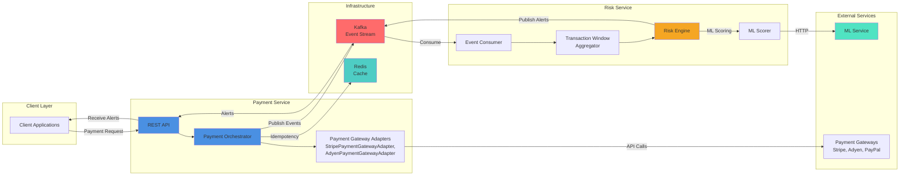

# Payment Integration Framework

A framework for integrating emerging payment technologies into digital payment systems. This framework standardizes integration patterns to reduce transaction failures, accelerate safe adoption of new payment methods, and mitigate operational and compliance risks .

Built on distributed systems architecture principles using Spring Boot, Kafka, Redis, and AWS, with intelligent ML-based risk detection capabilities.

## Features

### Project 1: Payment Integration Framework
- **Pluggable Payment Gateway Adapters**: Support for card, wallet, BNPL, crypto, and bank transfer payment gateways (Stripe, Adyen, PayPal, etc.)
- **Intelligent Gateway Routing**: Multiple routing strategies (Weighted Round-Robin, Least Connections, Cost-Based, Response Time-Based, Hybrid)
- **Automatic Failover**: Automatically fails over to alternative payment gateways when primary gateway fails
- **Gateway Performance Metrics**: Tracks success rate, latency, cost, and active connections per payment gateway
- **Idempotency**: Redis-backed idempotency to prevent duplicate charges
- **Resilience**: Circuit breakers and retry logic (Resilience4j) per payment gateway
- **Event-Driven Architecture**: Kafka events for audit, compliance, and downstream ML/analytics
- **REST API**: JSON API with OpenAPI documentation
- **Health Monitoring**: Actuator endpoints for Kafka, Redis, and circuit breaker health

### Project 2: Intelligent Risk & Fraud Detection System
- **ML-Based Risk Analysis**: Machine learning models analyze transaction data and failure patterns (optional ML integration via external service)
- **Real-Time Risk Identification**: Correlates historical transaction windows with real-time events to identify fraud patterns (high velocity, unusual amounts, repeated failures)
- **Automated Alert Generation**: Real-time alerts generated automatically when risk score exceeds threshold, enabling earlier intervention
- **Hybrid Risk Scoring**: Rule-based engine with optional ML integration - falls back to rules when ML service unavailable
- **Transaction Window Features**: Aggregates features over rolling time windows (5-minute window, 1-minute velocity) for risk scoring and ML model training
- **In-Memory Alert Store**: Last 100 alerts available via REST API for monitoring and analysis

## Tech Stack

| Component | Technology |
|-----------|-----------|
| Framework | Spring Boot 4.0.2 |
| Language | Java 17 |
| Message Broker | Apache Kafka |
| Cache | Redis |
| Resilience | Resilience4j |
| Testing | JUnit 5, Mockito, Testcontainers |
| API Docs | Swagger/OpenAPI 3 |

## Quick Start

### Prerequisites
- Java 17+
- Docker Desktop (for Kafka and Redis)
- Maven 3.6+

### 1. Start Infrastructure

```bash
docker-compose up -d
```

This starts:
- Kafka (port 9092)
- Zookeeper (port 2181)
- Redis (port 6379)

### 2. Build and Run

```bash
./mvnw clean install
./mvnw spring-boot:run
```

The application starts on `http://localhost:8080`

### 3. Verify Health

```bash
curl http://localhost:8080/actuator/health
```

Expected response:
```json
{
  "status": "UP",
  "components": {
    "kafka": {"status": "UP"},
    "redis": {"status": "UP"},
    "circuitBreakers": {"status": "UP"}
  }
}
```

### 4. Test Payment Execution

```bash
curl -X POST http://localhost:8080/api/v1/payments/execute \
  -H "Content-Type: application/json" \
  -d '{
    "idempotencyKey": "test-1",
    "providerType": "MOCK",
    "amount": 100.50,
    "currencyCode": "USD",
    "merchantReference": "order-123"
  }'
```

### 5. View Risk Alerts

**Option A: Trigger alerts** (via payment events - uses ML scoring if ML service is enabled, otherwise falls back to rule-based scoring):
```bash
# Trigger multiple failing payments quickly to trigger velocity alerts
for i in 1 2 3 4 5; do
  curl -s -X POST http://localhost:8080/api/v1/payments/execute \
    -H "Content-Type: application/json" \
    -d "{\"idempotencyKey\":\"risk-test-$i\",\"providerType\":\"MOCK\",\"amount\":999999,\"currencyCode\":\"USD\",\"merchantReference\":\"merchant-1\"}" > /dev/null
done

# Wait a few seconds for risk engine to process
sleep 3

# View alerts (check alert summary to see if ML or rules were used)
curl http://localhost:8080/api/v1/risk/alerts?limit=10
```

**Option B: View via Swagger UI**:
Open http://localhost:8080/swagger-ui/index.html and use the `/api/v1/risk/alerts` endpoint

### 6. View API Documentation

Open Swagger UI: http://localhost:8080/swagger-ui/index.html

## Architecture

### Checkout Flow: Customer to Framework Response

Simple end-to-end flow from customer checkout to response:

**Simplified Flow:**

1. **Customer sends request** → POST to `/api/v1/payments/execute` with payment details
2. **Framework receives** → PaymentController processes request
3. **Check idempotency** → Redis lookup for duplicate request
   - **If duplicate**: Return cached result instantly (<10ms)
   - **If new**: Continue to payment execution
4. **Select provider** → Router picks best provider (WeightedRoundRobin, CostBased, etc.)
5. **Execute payment** → Call provider with circuit breaker and retry
   - **If provider fails**: Automatically retry with next provider (up to 3 attempts)
6. **Store result** → Save in Redis for future idempotency checks (24-hour TTL)
7. **Publish event** → Send to Kafka for audit and risk analysis (async, non-blocking)
8. **Return response** → Send standardized result to customer UI
9. **Risk processing** → Risk engine analyzes event in background (doesn't block response)

**Response Time**: Typically 200-500ms (provider-dependent). Idempotency cache hits return in <10ms.

**Error Scenarios:**

- **Duplicate Request**: If same `idempotencyKey` is sent twice, second request returns cached result from Redis (<10ms)
- **Provider Failure**: Framework automatically fails over to next best provider (up to 3 attempts)
- **All Providers Down**: Returns `ALL_PROVIDERS_FAILED` error after exhausting all providers
- **Circuit Breaker Open**: Provider skipped, failover to next provider
- **Kafka Unavailable**: Payment still processes, but events may be lost (non-blocking)

**Idempotency Guarantee**: Same `idempotencyKey` always returns same result, even across provider failovers.

### System Architecture Diagram



### Key Components

- **PaymentOrchestrator**: Routes requests to appropriate payment gateway adapter with intelligent routing and automatic failover, applies idempotency, circuit breakers, and retries
- **ProviderRouter**: Selects best payment gateway (Stripe, Adyen, etc.) using configurable routing strategies (Weighted Round-Robin, Least Connections, Cost-Based, etc.)
- **ProviderPerformanceMetrics**: Tracks payment gateway performance (success rate, latency, cost, connections) for intelligent routing
- **Payment Gateway Adapters** (e.g., `StripePaymentGatewayAdapter`, `AdyenPaymentGatewayAdapter`): Code adapters that wrap external payment gateway APIs (Stripe, Adyen, PayPal) and convert between framework format and gateway-specific formats
- **IdempotencyService**: Redis-backed cache to prevent duplicate processing
- **PaymentEventProducer**: Publishes payment lifecycle events to Kafka
- **RiskEngine**: Evaluates payment events using rules and optional ML scoring
- **TransactionWindowAggregator**: Aggregates transaction features for risk scoring

**Note on Terminology:**
- **Payment Gateway Adapters** = Your code classes (`StripePaymentGatewayAdapter`, `AdyenPaymentGatewayAdapter`) that wrap external payment gateways
- **Payment Gateways** = External services (Stripe, Adyen, PayPal) - industry-standard term for payment processing services

## Configuration

Key configuration properties in `application.yaml`:

| Property | Default | Description |
|----------|---------|-------------|
| `spring.kafka.bootstrap-servers` | `localhost:9092` | Kafka broker address |
| `spring.data.redis.host` | `localhost` | Redis host |
| `spring.data.redis.port` | `6379` | Redis port |
| `payment.risk.engine.enabled` | `true` | Enable risk engine |
| `payment.risk.ml.enabled` | `true` | Enable ML scoring |
| `payment.risk.ml.service.url` | `http://localhost:5001/predict` | ML service endpoint |
| `payment.routing.strategy` | `WeightedRoundRobin` | Routing strategy (WeightedRoundRobin, LeastConnections, CostBased, ResponseTimeBased, Hybrid) |
| `payment.routing.failover.enabled` | `true` | Enable automatic failover to alternative payment gateways |
| `payment.routing.failover.max-attempts` | `3` | Maximum number of payment gateways to try before giving up |

See `src/main/resources/application.yaml` for complete configuration.

## Testing


### Project 1: Payment Integration Framework Tests

#### Unit Tests (No Docker Required)

```bash
# Run all unit tests
./mvnw test

# Run specific Project 1 tests
./mvnw test -Dtest=PaymentControllerTest
./mvnw test -Dtest=PaymentOrchestratorTest
./mvnw test -Dtest=IdempotencyServiceTest
```

**Coverage:**
- `PaymentController` - REST API endpoints, validation, response format
- `PaymentOrchestrator` - Payment gateway adapter routing, idempotency, circuit breakers
- `IdempotencyService` - Redis operations (mocked)

### Project 2: Risk & Fraud Detection Tests

#### Unit Tests (No Docker Required)

```bash
# Run all unit tests
./mvnw test

# Run specific Project 2 tests
./mvnw test -Dtest=RiskEngineTest
./mvnw test -Dtest=TransactionWindowAggregatorTest
./mvnw test -Dtest=RiskAlertControllerTest

# Run all Project 2 tests
./mvnw test -Dtest=RiskEngineTest,TransactionWindowAggregatorTest,RiskAlertControllerTest
```

**Coverage:**
- `RiskEngine` - Risk scoring rules, ML integration, alert generation
- `TransactionWindowAggregator` - Feature aggregation over time windows
- `RiskAlertController` - REST API for alerts

#### Manual Testing: Risk Scenarios

**Test 1: High Velocity Alert** (Multiple transactions in short time)
```bash
# Trigger 10+ payments in quick succession
for i in {1..12}; do
  curl -s -X POST http://localhost:8080/api/v1/payments/execute \
    -H "Content-Type: application/json" \
    -d "{\"idempotencyKey\":\"velocity-test-$i\",\"providerType\":\"MOCK\",\"amount\":100,\"currencyCode\":\"USD\",\"merchantReference\":\"merchant-1\"}" > /dev/null
done

# Wait for risk engine to process
sleep 3

# Check for alerts
curl http://localhost:8080/api/v1/risk/alerts?limit=10
```

**Test 2: High Failure Rate Alert** (Multiple failures)
```bash
# Trigger multiple failing payments (amount >= 999999 triggers failure in MockPaymentGatewayAdapter)
for i in {1..5}; do
  curl -s -X POST http://localhost:8080/api/v1/payments/execute \
    -H "Content-Type: application/json" \
    -d "{\"idempotencyKey\":\"failure-test-$i\",\"providerType\":\"MOCK\",\"amount\":999999,\"currencyCode\":\"USD\",\"merchantReference\":\"merchant-2\"}" > /dev/null
done

sleep 3
curl http://localhost:8080/api/v1/risk/alerts?limit=10
```

**Test 3: Unusual Amount Alert** (Amount significantly higher than average)
```bash
# First, establish a baseline with normal amounts
for i in {1..5}; do
  curl -s -X POST http://localhost:8080/api/v1/payments/execute \
    -H "Content-Type: application/json" \
    -d "{\"idempotencyKey\":\"baseline-$i\",\"providerType\":\"MOCK\",\"amount\":100,\"currencyCode\":\"USD\",\"merchantReference\":\"merchant-3\"}" > /dev/null
done

# Then trigger an unusually high amount (2x+ average)
curl -s -X POST http://localhost:8080/api/v1/payments/execute \
  -H "Content-Type: application/json" \
  -d '{"idempotencyKey":"unusual-amount","providerType":"MOCK","amount":500,"currencyCode":"USD","merchantReference":"merchant-3"}'

sleep 3
curl http://localhost:8080/api/v1/risk/alerts?limit=10
```

**Test 4: ML Integration** (If ML service is running)
```bash
# Ensure ML service is running on port 5001
# Check if ML scoring is enabled in application.yaml:
# payment.risk.ml.enabled: true

# Trigger payments and check if alerts show "ML" in summary
curl -X POST http://localhost:8080/api/v1/payments/execute \
  -H "Content-Type: application/json" \
  -d '{"idempotencyKey":"ml-test","providerType":"MOCK","amount":999999,"currencyCode":"USD","merchantReference":"merchant-1"}'

sleep 3
curl http://localhost:8080/api/v1/risk/alerts?limit=1 | jq '.[0].summary'
# Should show "ML" in summary if ML service responded
```

### Integration Tests (Docker Required)

```bash
# Ensure Docker is running
./mvnw test -DincludeTags=integration
```

**What it tests:**
- End-to-end payment execution → Kafka event → risk evaluation → alert generation
- Redis idempotency with real Redis instance (Testcontainers)
- Kafka event flow with Embedded Kafka

## Adding a New Payment Gateway

To add support for a new payment gateway (e.g., Square, Braintree):

1. **Implement `PaymentGatewayAdapter` interface** (creates a payment gateway adapter):

```java
@Component
public class StripePaymentGatewayAdapter implements PaymentGatewayAdapter {
    @Override
    public PaymentProviderType getProviderType() {
        return PaymentProviderType.CARD;
    }
    
    @Override
    public PaymentResult execute(PaymentRequest request) {
        // Call Stripe API (external payment service)
        // Map response to PaymentResult
        return PaymentResult.builder()
            .idempotencyKey(request.getIdempotencyKey())
            .status(TransactionStatus.SUCCESS)
            // ... other fields
            .build();
    }
}
```

2. **Register the bean** - `PaymentOrchestrator` auto-discovers by `getProviderType()`

3. **Configure circuit breaker** (optional) - add entry in `application.yaml` under `resilience4j.circuitbreaker.instances`

## Provider Routing and Failover

The framework supports intelligent provider routing and automatic failover:

### Routing Strategies

Configure routing strategy in `application.yaml`:

```yaml
payment:
  routing:
    strategy: WeightedRoundRobin  # Options: WeightedRoundRobin, LeastConnections, CostBased, ResponseTimeBased, Hybrid
    failover:
      enabled: true
      max-attempts: 3
```

**Available Strategies:**
- **WeightedRoundRobin**: Routes based on provider success rate (higher success = more traffic)
- **LeastConnections**: Routes to provider with fewest active connections
- **CostBased**: Routes to provider with lowest effective cost (cost / success rate)
- **ResponseTimeBased**: Routes to provider with lowest average latency
- **Hybrid**: Combines success rate (40%), latency (30%), cost (20%), connections (10%)

### View Provider Metrics

```bash
# Get metrics for all providers
curl http://localhost:8080/api/v1/routing/metrics

# Get metrics for specific provider
curl http://localhost:8080/api/v1/routing/metrics/CARD
```

### Automatic Failover

When a provider fails (circuit breaker opens), the framework automatically:
1. Selects next best provider using routing strategy
2. Retries payment with alternative provider
3. Tracks metrics for both attempts
4. Returns result from successful provider

Failover is enabled by default and can be configured in `application.yaml`.

## ML Integration

The framework supports ML-based risk scoring:

1. **Start ML service** (Flask/FastAPI) on port 5001
2. **Enable ML scoring** in `application.yaml`:
   ```yaml
   payment:
     risk:
       ml:
         enabled: true
         service:
           url: http://localhost:5001/predict
   ```
3. **Generate training data**:
   ```bash
   curl http://localhost:8080/api/v1/risk/training-data?merchantId=merchant-1&limit=1000
   ```

## License

Research / educational use.
