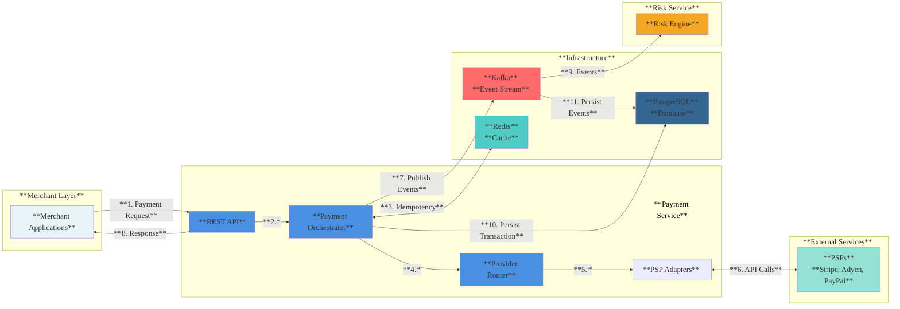
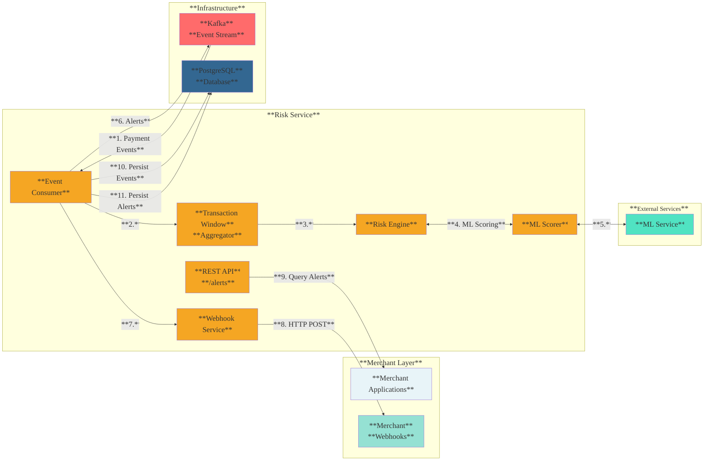
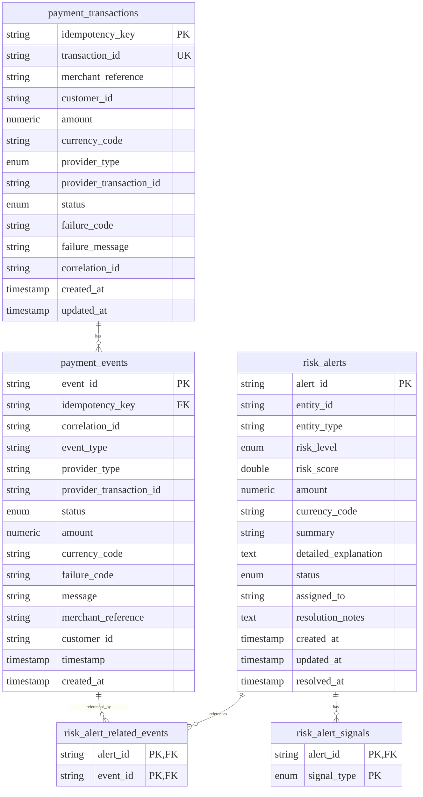

# Payment Integration Framework

A payment orchestration framework that helps merchants process payments across multiple payment providers (Stripe, Adyen, PayPal, etc.) with intelligent routing based on cost, performance, and success rates. Automatically switches to backup providers if one fails, and detects fraud by aggregating patterns across all providers—catching distributed attacks that individual providers miss. Built with Spring Boot, Kafka, and Redis for scalability and compliance.


Built on distributed systems architecture principles using Spring Boot, Kafka, Redis with intelligent ML-based risk detection capabilities.

## What You'll Learn

- How to design a pluggable PSP (Payment Service Provider) architecture
- Implementing idempotency to prevent duplicate charges
- Building resilient systems with circuit breakers and retry logic
- Creating an event-driven architecture for audit and compliance

## Key Benefits

- **Vendor Independence**: Not locked into a single PSP - easily switch or add new providers without rewriting code.
- **Cost Optimization**: Automatically routes to the most cost-effective PSP based on transaction fees and success rates.
- **High Availability**: Automatic failover to backup PSPs when primary PSP fails, ensuring payments continue processing.
- **Duplicate Charge Prevention**: Built-in idempotency prevents duplicate charges from network retries or user double-clicks.
- **Unified Fraud Detection**: Detects fraud from single PSP and across multiple PSPs (Stripe, PayPal, Adyen, etc.) - identifies high failure rates and velocity attacks within a single PSP, plus cross-PSP distributed attacks like gateway hopping, distributed velocity, and card testing that individual PSPs miss.
- **Fraud Protection**: ML-based risk scoring analyzes payments in near-real-time and sends alerts when fraud is detected
- **Compliance & Audit**: Automatic event logging and audit trails for regulatory compliance and transaction tracking.
- **Easy Scaling**: Start with one PSP, add more as business grows - framework handles complexity automatically.

## Features

### Project 1: Payment Integration Framework
- **Pluggable PSP Adapters**: Support for emerging payment types (card, wallet, BNPL, bank transfer) via PSPs like Stripe, Adyen, PayPal, Afterpay, Klarna, etc. Framework is extensible to support crypto and other emerging payment methods.
- **Intelligent PSP Routing**: Multiple routing strategies (Weighted Round-Robin, Least Connections, Cost-Based, Response Time-Based, Hybrid)
- **Automatic Failover**: Automatically fails over to alternative PSPs when primary PSP fails
- **PSP Performance Metrics**: Tracks success rate, latency, cost, and active connections per PSP
- **Idempotency**: Redis-backed idempotency to prevent duplicate charges
- **Resilience**: Circuit breakers and retry logic (Resilience4j) per PSP
- **Event-Driven Architecture**: Kafka events for audit, compliance, and downstream ML/analytics
- **REST API**: JSON API with OpenAPI documentation
- **Health Monitoring**: Actuator endpoints for Kafka, Redis, and circuit breaker health


### Project 2: Intelligent Risk & Fraud Detection System

- **Unified Fraud Detection**: Detects fraud from single PSP or across multiple PSPs by aggregating events by entity (merchant/customer), catching both single-PSP patterns and distributed cross-PSP attacks
- **ML-Based Risk Analysis**: Machine learning models analyze transaction data and failure patterns (optional ML integration via external service)
- **Real-Time Risk Identification**: Correlates historical transaction windows with real-time events to identify fraud patterns (high velocity, unusual amounts, repeated failures)
- **Automated Alert Generation**: Real-time alerts generated automatically when risk score exceeds threshold, enabling earlier intervention
- **Hybrid Risk Scoring**: Rule-based engine with optional ML integration - falls back to rules when ML service unavailable
- **Transaction Window Features**: Computes metrics (velocity, failure rate, average amount, max amount) over rolling time windows (5-minute window, 1-minute velocity) per entity (merchant/customer) - aggregates events from single PSP or across multiple PSPs for comprehensive fraud and risk analysis
- **In-Memory Alert Store**: Last 100 alerts available via REST API for monitoring and analysis

## Tech Stack

| Component | Technology |
|-----------|-----------|
| Framework | Spring Boot 4.0.2 |
| Language | Java 17 |
| Message Broker | Apache Kafka |
| Cache | Redis |
| Database | PostgreSQL 15 |
| ORM | JPA/Hibernate |
| Migration | Flyway |
| Resilience | Resilience4j |
| Testing | JUnit 5, Mockito, Testcontainers |
| API Docs | Swagger/OpenAPI 3 |

## Quick Start

For detailed local setup and testing instructions, see [LOCAL_TESTING.md](LOCAL_TESTING.md).

**Quick overview:**
1. Start infrastructure: `docker-compose up -d`
2. Build and run: `./mvnw spring-boot:run`
3. Application available at `http://localhost:8080`
4. API docs at `http://localhost:8080/swagger-ui/index.html`

## Architecture

### Checkout Flow: Customer to Framework Response

Simple end-to-end flow from customer checkout to response:

**Simplified Flow:**

1. **Customer sends request** → POST to `/api/v1/payments/execute` with payment details
2. **Framework receives** → PaymentController processes request
3. **Check idempotency** → Redis lookup for duplicate request
   - **If duplicate**: Return cached result instantly (<10ms)
   - **If new**: Continue to payment execution
4. **Select provider** → Router picks best provider (WeightedRoundRobin, CostBased, etc.)
5. **Execute payment** → Call provider with circuit breaker and retry
   - **If provider fails**: Automatically retry with next provider (up to 3 attempts)
6. **Store result** → Save in Redis for future idempotency checks (24-hour TTL)
7. **Publish event** → Send to Kafka for audit and risk analysis (async, non-blocking)
8. **Return response** → Send standardized result to customer UI
9. **Risk processing** → Risk engine analyzes event in background (doesn't block response)

**Response Time**: Typically 200-500ms (provider-dependent). Idempotency cache hits return in <10ms.

**Error Scenarios:**

- **Duplicate Request**: If same `idempotencyKey` is sent twice, second request returns cached result from Redis (<10ms)
- **Provider Failure**: Framework automatically fails over to next best provider (up to 3 attempts)
- **All Providers Down**: Returns `ALL_PROVIDERS_FAILED` error after exhausting all providers
- **Circuit Breaker Open**: Provider skipped, failover to next provider
- **Kafka Unavailable**: Payment still processes, but events may be lost (non-blocking)

**Idempotency Guarantee**: Same `idempotencyKey` always returns same result, even across provider failovers.

### Project 1: Payment Integration Architecture



### Project 2: Risk & Fraud Detection Architecture



### Database Schema

The framework uses PostgreSQL for persistent storage of payment transactions, events, and risk alerts. The database schema is managed via Flyway migrations.



### Key Components

- **PaymentOrchestrator**: Routes requests to appropriate PSP adapter with intelligent routing and automatic failover, applies idempotency, circuit breakers, and retries
- **ProviderRouter**: Selects best PSP (Stripe, Adyen, etc.) using configurable routing strategies (Weighted Round-Robin, Least Connections, Cost-Based, etc.)
- **ProviderPerformanceMetrics**: Tracks PSP performance (success rate, latency, cost, connections) for intelligent routing
- **PSP Adapters** (e.g., `StripeAdapter`, `AdyenAdapter`): Code adapters that wrap external PSP APIs (Stripe, Adyen, PayPal) and convert between framework format and PSP-specific formats
- **IdempotencyService**: Redis-backed cache to prevent duplicate processing
- **PaymentEventProducer**: Publishes payment lifecycle events to Kafka 
- **PaymentPersistenceService**: Persists payment transactions and events to PostgreSQL for compliance and audit
- **RiskEngine**: Evaluates payment events using rules and optional ML scoring, also detects cross-PSP fraud patterns
- **TransactionWindowAggregator**: Aggregates transaction features across all PSPs by entity (merchant/customer) for risk scoring
- **WebhookService**: Delivers risk alerts to merchant webhook endpoints in real-time with retry logic and async delivery

## Terminology

| Term | Definition | Example |
|------|------------|---------|
| **Merchant** | Business accepting payments | E-commerce site, mobile app, etc |
| **Merchant Applications** | Merchant's software integrating with framework | Checkout page, mobile app backend, etc |
| **Merchant Webhooks** | Merchant's HTTP endpoints for real-time alerts | `https://merchant.com/webhooks/alerts` |
| **PSP** | External payment service | Stripe, Adyen, PayPal, Afterpay (BNPL), etc. |
| **PSPAdapter** | Framework code class wrapping PSP API | `StripeAdapter.java`, `AdyenAdapter.java`, etc |
| **Payment Types** | Payment methods supported | Card, Wallet, BNPL, Bank Transfer (Crypto supportable via extensible adapter pattern) |
| **Entity ID** | Identifier for grouping transactions (merchant/customer) | `merchant-123`, `customer-abc` |

## Configuration

Key configuration properties in `application.yaml`:

| Property | Default | Description |
|----------|---------|-------------|
| `spring.kafka.bootstrap-servers` | `localhost:9092` | Kafka broker address |
| `spring.data.redis.host` | `localhost` | Redis host |
| `spring.data.redis.port` | `6379` | Redis port |
| `spring.datasource.url` | `jdbc:postgresql://localhost:5432/payment_framework` | PostgreSQL database URL |
| `spring.datasource.username` | `postgres` | Database username |
| `spring.datasource.password` | `postgres` | Database password |
| `spring.flyway.enabled` | `true` | Enable Flyway migrations |
| `spring.flyway.locations` | `classpath:db/migration` | Migration scripts location |
| `payment.risk.engine.enabled` | `true` | Enable risk engine |
| `payment.risk.ml.enabled` | `true` | Enable ML scoring |
| `payment.risk.ml.service.url` | `http://localhost:5001/predict` | ML service endpoint |
| `payment.routing.strategy` | `WeightedRoundRobin` | Routing strategy (WeightedRoundRobin, LeastConnections, CostBased, ResponseTimeBased, Hybrid) |
| `payment.routing.failover.enabled` | `true` | Enable automatic failover to alternative PSPs |
| `payment.routing.failover.max-attempts` | `3` | Maximum number of PSPs to try before giving up |

See `src/main/resources/application.yaml` for complete configuration.

## Testing

For comprehensive testing instructions including unit tests, integration tests, manual testing scenarios, and webhook testing, see [LOCAL_TESTING.md](LOCAL_TESTING.md).

**Quick test commands:**
- Run all tests: `./mvnw test`
- Run integration tests: `./mvnw test -DincludeTags=integration`
- Test webhooks: `./test-webhook.sh`

## Adding a New PSP

To add support for a new PSP (e.g., Square, Braintree):

1. **Implement `PSPAdapter` interface** (creates a PSP adapter):

```java
@Component
public class StripeAdapter implements PSPAdapter {
    @Override
    public PaymentProviderType getProviderType() {
        return PaymentProviderType.CARD;
    }
    
    @Override
    public PaymentResult execute(PaymentRequest request) {
        // Call Stripe API (external payment service)
        // Map response to PaymentResult
        return PaymentResult.builder()
            .idempotencyKey(request.getIdempotencyKey())
            .status(TransactionStatus.SUCCESS)
            // ... other fields
            .build();
    }
}
```

2. **Register the bean** - `PaymentOrchestrator` auto-discovers by `getProviderType()`

3. **Configure circuit breaker** (optional) - add entry in `application.yaml` under `resilience4j.circuitbreaker.instances`

## Provider Routing and Failover

The framework supports intelligent provider routing and automatic failover:

### Routing Strategies

Configure routing strategy in `application.yaml`:

```yaml
payment:
  routing:
    strategy: WeightedRoundRobin  # Options: WeightedRoundRobin, LeastConnections, CostBased, ResponseTimeBased, Hybrid
    failover:
      enabled: true
      max-attempts: 3
```

**Available Strategies:**
- **WeightedRoundRobin**: Routes based on provider success rate (higher success = more traffic)
- **LeastConnections**: Routes to provider with fewest active connections
- **CostBased**: Routes to provider with lowest effective cost (cost / success rate)
- **ResponseTimeBased**: Routes to provider with lowest average latency
- **Hybrid**: Combines success rate (40%), latency (30%), cost (20%), connections (10%)

### View Provider Metrics

```bash
# Get metrics for all providers
curl http://localhost:8080/api/v1/routing/metrics

# Get metrics for specific provider
curl http://localhost:8080/api/v1/routing/metrics/CARD
```

## Database Persistence

The framework uses PostgreSQL for persistent storage of payment transactions, events, and risk alerts. All database operations are handled automatically via Flyway migrations and JPA entities.

For detailed database setup, schema documentation, querying examples, and troubleshooting, see [POSTGRES_SETUP.md](POSTGRES_SETUP.md).

## ML Integration

The framework supports ML-based risk scoring:

1. **Start ML service** (Flask/FastAPI) on port 5001
2. **Enable ML scoring** in `application.yaml`:
   ```yaml
   payment:
     risk:
       ml:
         enabled: true
         service:
           url: http://localhost:5001/predict
   ```
3. **Generate training data**:
   ```bash
   curl http://localhost:8080/api/v1/risk/training-data?merchantId=merchant-1&limit=1000
   ```

## License

Research / educational use.
